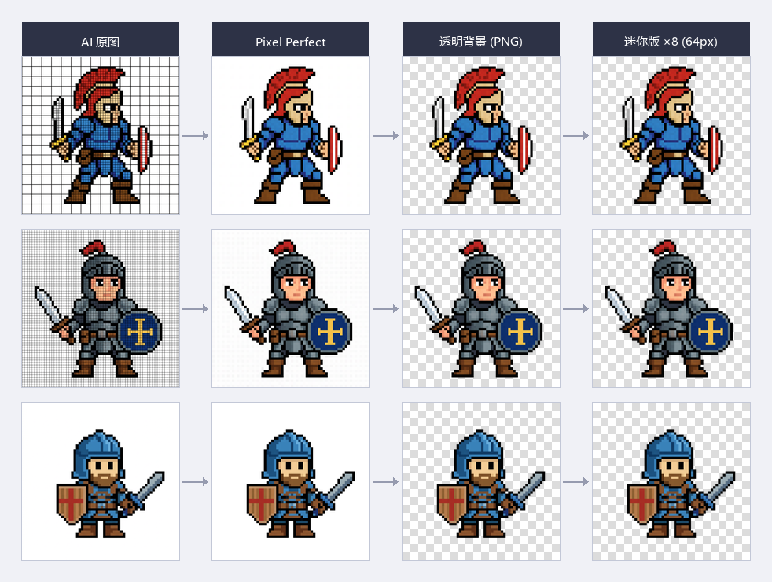

# Pixel Perfect Converter

将 AI 生成的像素风格图片转换为真正 pixel perfect 输出的工具集。

---

## 项目说明

AI 大模型（如 Stable Diffusion、Flux、Midjourney 等）可以生成像素风格图片，但输出结果通常并非真正"pixel perfect"——每个逻辑像素内存在颜色噪点、边缘抗锯齿，网格对齐也可能在图像不同区域出现漂移。

本工具的核心思路是：**通过预处理（传入参考网格图）+ 后处理（网格遵循度评估 + 像素完美修复）的 Mod 模式**，将大模型的生成能力转化为真正 pixel perfect 的输出，无需微调或训练。



*从左到右：AI 原图（含网格线与抗锯齿）→ Pixel Perfect 修复版 → 透明背景 PNG → 迷你 64px 版（×8 放大展示）*

---

## 目录结构

```
pixel_grid/
  grid_1px_black.png        # 参考网格图（传给 AI 的 ControlNet/参考图）

algo4/
  run.py                    # 核心算法：网格遵循度评估 + 像素完美修复
  evaluate.py               # 批量评估脚本（对目录下所有图片运行）
  ALGORITHM.md              # 算法详细说明

shared_utils.py             # 通用工具函数（背景去除、网格检测等）
pictures/                   # 测试图片目录

_archive/                   # 早期探索的算法（algo1/2/3）归档
```

---

## 快速开始

### 安装依赖

```bash
pip install Pillow numpy scipy -i https://pypi.tuna.tsinghua.edu.cn/simple
```

Python 3.10+ 必须。

### 单张图片处理

```bash
python algo4/run.py <图片路径> --grid-ref pixel_grid/grid_1px_black.png
```

### 批量处理

```bash
python algo4/evaluate.py --src pictures/ --grid-ref pixel_grid/grid_1px_black.png
```

结果保存在 `algo4/results/` 下，每张图对应一个子目录。

---

## 详细使用说明

见 [USAGE.md](USAGE.md)

---

## 探索历程

见 [JOURNEY.md](JOURNEY.md)

---

## 许可证

Copyright (C) 2026 [likeUMR](https://github.com/likeUMR)

本项目基于 [GNU General Public License v3.0](LICENSE) 开源。
